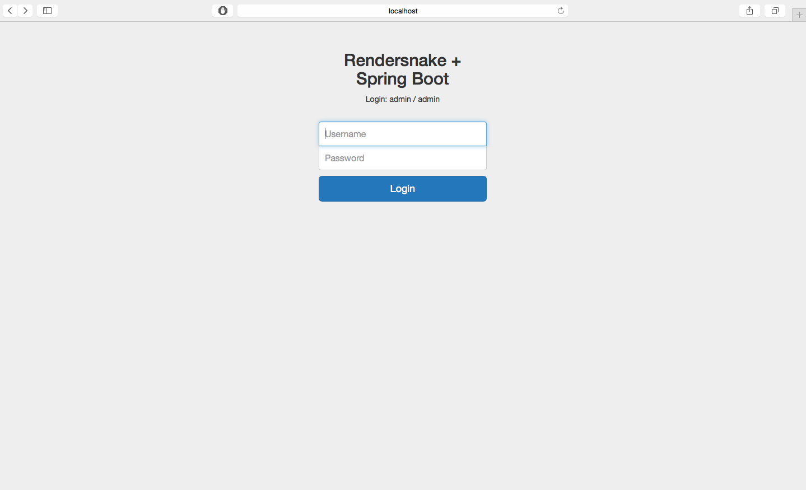
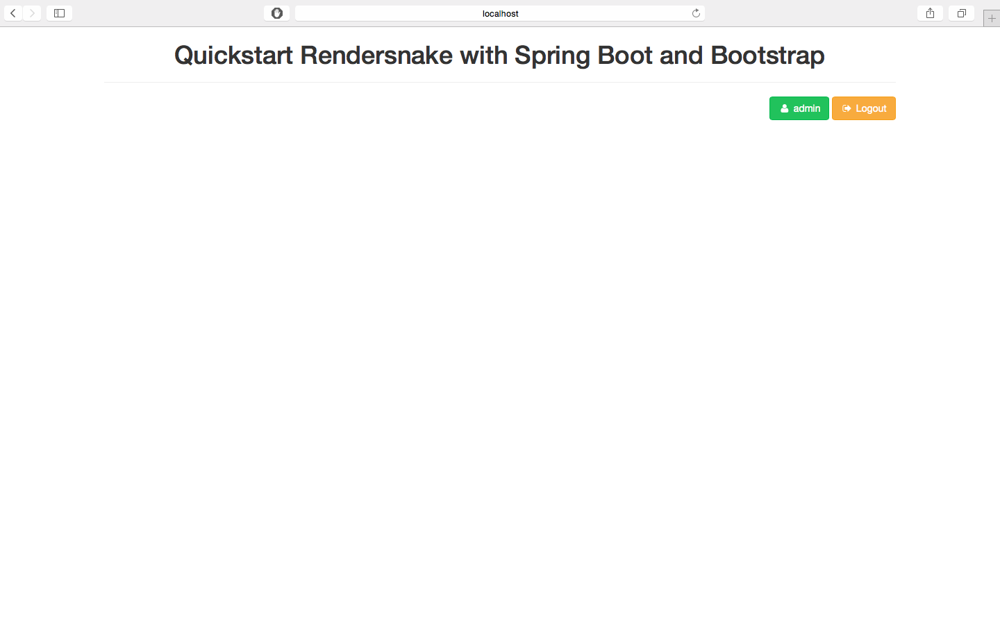

quickstart-rendersnake-spring-boot
===========
Simple example Login story with:
- Rendersnake (Spring part)
- Spring Boot
- Twitter Bootstrap
- Font-awesome

New Feature:
- Manage redirect key-word in controller
- Template framework

# Redirect key-word
To make a redirect url in the spring controller you can use the 'redirect:/someURL' in the return method.
```java
@Controller
@RequestMapping(value = "/login" )
public class LoginController {
	
	@RequestMapping(method = RequestMethod.POST)
	public String checkLoginAndDisplayPage(@Valid LoginBinder loginBinder, BindingResult result) {
		if (result.hasErrors()) {
			return "redirect:/login?error";
		}
		return "redirect:/welcome";
	}
	
	@RequestMapping(method = RequestMethod.GET)
	public String displayLoginPage() {
		return "loginPage";
	}
}
```
# Template framework
For a clearer code you can use the @Template annotation. It's allow you to apply a template to your page. 

1. Create your template (implements TemplateDescriptor)
```java
public class DefaultTemplate implements TemplateDescriptor {
	
	// Define the default title of your page use in <title></title>
	@Override
	public String getDefaultTitle() {
		return "RenderSnake"; 
	}
	
	// Html write in <head></head>
	@Override
	public void renderHeaderOn(HtmlCanvas html) throws IOException {
		html.meta(charset("utf-8"))
		    .meta(http_equiv("X-UA-Compatible").content("IE=edge"))
		    .meta(name("viewport").content("width=device-width, initial-scale=1"))
		     
		    // Import Bootstrap + Font-awesome libraries and css 
		    .macros().stylesheet("/bower_components/bootstrap/dist/css/bootstrap.min.css")
		    .macros().stylesheet("/bower_components/fontawesome/css/font-awesome.min.css")
		    .macros().javascript("/bower_components/jquery/dist/jquery.min.js")
		    .macros().javascript("/bower_components/bootstrap/dist/js/bootstrap.min.js");
	}
	
	// Html write just after <body>
	@Override
	public void renderBodyStartOn(HtmlCanvas html) throws IOException {
		html.div(class_("container")); 
	}
	
	// Html write just before </body>
	@Override
	public void renderBodyEndOn(HtmlCanvas html) throws IOException {
		html._div(); // end container
	}
```

2. Apply your template using @Template annotation on your page
```java
@Component
@Template(DefaultTemplate.class)
public class WelcomePage implements Renderable {

	@Override
	public void renderOn(HtmlCanvas html) throws IOException {
		html.h1().content("Quickstart Rendersnake");
		// html stuff...
	}
}
```

3. You can use inheritance with your template, you keep or override the behavior of the default template
```java
public class LoginTemplate extends DefaultTemplate {
	
	@Override
	public String getDefaultTitle() {
		return "Login";
	}
	
	@Override
	public void renderHeaderOn(HtmlCanvas html) throws IOException {
		super.renderHeaderOn(html);
		html.macros().stylesheet("/css/signin.css");
	}
}
```
4. Apply your inherited template to your page
```java
@Component
@Template(LoginTemplate.class)
public class LoginPage implements Renderable {

	@Override
	public void renderOn(HtmlCanvas html) throws IOException {
		// html stuff...
	}
}
```

# Screenshots


